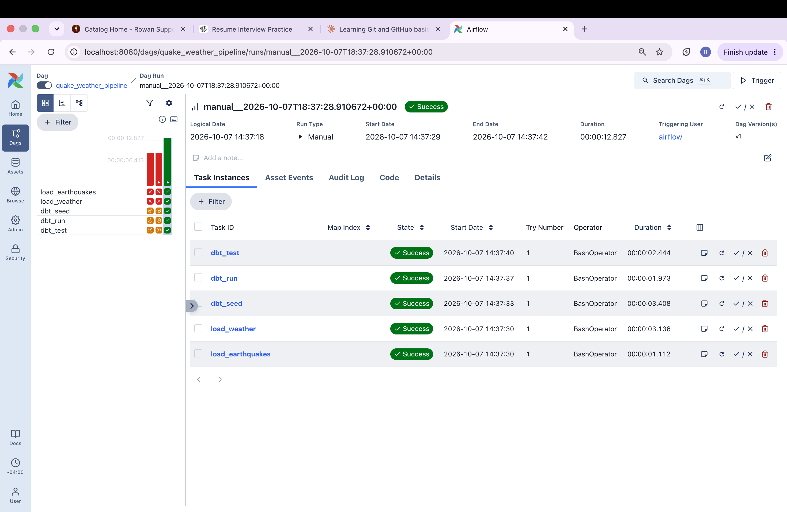

# Quake & Weather Data Platform

An automated, containerized data pipeline that collects **earthquake** and **weather** data from public APIs, loads it into **PostgreSQL**, transforms it with **dbt**, tests data quality, and runs on a daily schedule with **Apache Airflow**.

The project follows the layered design used in production data teams: raw data lands untouched, staging models clean it, and marts combine it into analysis-ready tables.

## Architecture

```
  USGS Earthquake API ─┐
                       ├─> Python extract ─> PostgreSQL  (raw schema)
  Open-Meteo API ──────┘                           │
                                                   ▼
                                   dbt staging models  (cleaned views)
                                                   │
                                                   ▼
                                   dbt marts  (analytics tables)

  Orchestrated by Apache Airflow · Packaged with Docker Compose
```



## Features

- **Two data sources:** live earthquakes (USGS) and daily weather for five cities (Open-Meteo). Neither needs an API key.
- **Resilient extraction:** requests retry temporary server errors (5xx) and connection problems with exponential backoff, and fail immediately on client errors (4xx), which retrying cannot fix.
- **Idempotent loading:** data is upserted, so rerunning the pipeline never creates duplicates and late corrections from the APIs are picked up.
- **Layered transformations:** `raw` (untouched source data), `staging` (cleaning and derived columns), and `marts` (summary tables).
- **Geographic join:** a mart links each city's daily weather with earthquakes that happened within 1,000 km, using the haversine distance formula.
- **Automated data quality tests:** dbt tests check uniqueness and missing values on every run.
- **Orchestration:** an Airflow DAG runs both loads, then dbt seed, run, and test, once a day.
- **Reproducible environment:** PostgreSQL and Airflow run in Docker, and Airflow uses a separate virtual environment for the pipeline's dependencies so they never clash with Airflow's own.
- **Unit tests:** pytest covers parsing and the retry logic, using mocked HTTP responses so tests are fast and run offline.

## Tech stack

| Area | Tools |
|---|---|
| Language | Python, SQL |
| Data handling | pandas, SQLAlchemy, psycopg2 |
| Database | PostgreSQL 16 |
| Transformation and testing | dbt (dbt-postgres) |
| Orchestration | Apache Airflow |
| Containers | Docker, Docker Compose |
| Testing | pytest |
| Version control | Git, GitHub |

## Data sources

| Source | What it provides | Notes |
|---|---|---|
| [USGS Earthquake API](https://earthquake.usgs.gov/fdsnws/event/1/) | Recent earthquakes worldwide (magnitude 2.5 and above by default) | Free, no key |
| [Open-Meteo API](https://open-meteo.com/) | Daily max and min temperature and precipitation | Free, no key. Cities: Tokyo, Los Angeles, Santiago, Istanbul, Jakarta |

## Data model

| Layer | Schema | Objects | Purpose |
|---|---|---|---|
| Raw | `raw` | `earthquakes`, `weather_daily` | Source data, loaded as-is with a `loaded_at` timestamp |
| Staging | `analytics` | `stg_earthquakes`, `stg_weather_daily` (views) | Filtering, renaming, region, severity label, average temperature |
| Seed | `analytics` | `cities` | Reference table of city coordinates |
| Marts | `analytics` | `mart_daily_earthquake_summary`, `mart_city_quake_exposure` (tables) | Analysis-ready summaries |

**Severity labels** in `stg_earthquakes`: `major` (magnitude 7 and above), `moderate` (5 and above), `light` (4 and above), `minor` (below 4).

**Primary keys:** `raw.earthquakes` uses `event_id`. `raw.weather_daily` uses `(city, weather_date)`.

**Example query:** days with the most earthquakes near a city:

```sql
SELECT city, weather_date, nearby_quakes, max_nearby_magnitude
FROM analytics.mart_city_quake_exposure
ORDER BY nearby_quakes DESC, weather_date DESC
LIMIT 10;
```

## Project structure

```
quake-weather-platform/
├── extract/                  API clients with retry logic
│   ├── http_utils.py         shared GET-with-retry helper
│   ├── usgs.py               earthquake extraction
│   └── weather.py            weather extraction
├── load/                     PostgreSQL loaders (upserts)
│   ├── db.py                 database connection from .env
│   ├── load_earthquakes.py
│   └── load_weather.py
├── transform/                dbt project
│   ├── models/staging/       cleaned views and tests
│   ├── models/marts/         summary tables and tests
│   ├── seeds/cities.csv      city coordinates
│   ├── dbt_project.yml
│   └── profiles.yml          reads credentials from environment variables
├── airflow/                  orchestration
│   ├── dags/quake_weather_pipeline.py
│   ├── Dockerfile            custom image with an isolated pipeline venv
│   ├── docker-compose.yaml   Airflow quick-start compose file
│   └── docker-compose.override.yaml
├── tests/                    pytest unit tests
├── docs/                     screenshots and notes
├── docker-compose.yml        PostgreSQL
├── requirements.txt
└── .env.example              template for database settings
```

## Getting started

### Prerequisites

- Python 3.11 or newer
- Docker Desktop (running)
- Git

### 1. Clone and set up Python

```bash
git clone https://github.com/<your-username>/quake-weather-platform.git
cd quake-weather-platform
python3 -m venv venv
source venv/bin/activate
pip install -r requirements.txt
```

### 2. Configure database settings

```bash
cp .env.example .env
```

Open `.env` and set your own `POSTGRES_PASSWORD`. The `.env` file is ignored by Git, so your password stays private.

### 3. Start PostgreSQL

```bash
docker compose up -d
docker compose ps        # quake_postgres should show as Up
```

### 4. Load the data

```bash
python -m load.load_earthquakes
python -m load.load_weather
```

Run these as many times as you like. Existing rows are updated, not duplicated.

### 5. Transform and test with dbt

```bash
set -a; source .env; set +a     # makes your .env settings visible to dbt
cd transform
dbt seed --profiles-dir .
dbt run --profiles-dir .
dbt test --profiles-dir .
```

You need to run the `set -a; source .env; set +a` line again in every new terminal window.

### 6. Inspect the results

```bash
docker exec -it quake_postgres psql -U quake_user -d quake_db \
  -c "SELECT * FROM analytics.mart_city_quake_exposure ORDER BY nearby_quakes DESC LIMIT 8;"
```

## Run on a schedule with Airflow

The Airflow stack is separate from the database stack, so start the database first (step 3 above).

```bash
cd airflow
mkdir -p logs plugins config
echo "AIRFLOW_UID=50000" > .env
echo "AIRFLOW_IMAGE_NAME=quake-airflow:latest" >> .env
docker build -t quake-airflow:latest .
docker compose up airflow-init
docker compose up -d
```

Then open <http://localhost:8080>, log in (the quick-start default is `airflow` / `airflow`), switch on **quake_weather_pipeline**, and click **Trigger**.

**DAG flow:**

```
load_earthquakes ─┐
                  ├─> dbt_seed ─> dbt_run ─> dbt_test
load_weather ─────┘
```

The DAG is scheduled `@daily`. Each task runs inside the Airflow worker, using a dedicated virtual environment (`/opt/airflow/pipeline_venv`) built into the custom image. `docker-compose.override.yaml` mounts the project into the worker and points it at the PostgreSQL container.

To stop Airflow: `docker compose down` (inside the `airflow` folder).

## Testing

```bash
python -m pytest -v
```

The tests mock HTTP responses, so they run offline and never depend on an external API being healthy. They cover:

- Parsing earthquake data into a table (field mapping, UTC time conversion, empty results)
- Retry behavior: retry on 5xx errors, do not retry on 4xx errors, give up after the maximum number of attempts
- Building the weather table for one city and for all cities

dbt adds data quality tests (`unique`, `not_null`) that run as the final step of every pipeline run.

## Design decisions

- **Upserts for idempotency.** Pipelines get rerun after failures. Primary keys plus `ON CONFLICT DO UPDATE` make reruns safe, and let corrected values from the APIs overwrite older ones.
- **Raw layer kept untouched.** Cleaning happens in dbt, so any transformation can be changed and rebuilt without re-downloading data.
- **Retry only what can recover.** Server errors and dropped connections are temporary, but a bad request (4xx) will fail every time, so it is raised immediately.
- **Credentials from the environment.** Passwords live in `.env`, which is not committed. `profiles.yml` reads environment variables, so it contains no secrets and is safe to commit.
- **Isolated Python environment inside Airflow.** dbt and Airflow have conflicting dependency requirements, so the pipeline runs in its own virtual environment built into the image.
- **Rolling re-fetch of weather.** Each run re-fetches the last few days, which picks up late corrections.

## Troubleshooting

| Problem | Likely cause and fix |
|---|---|
| `Connection refused` on port 5432 | The database container is not running. Open Docker Desktop and run `docker compose up -d` in the project root |
| `502 Bad Gateway` from USGS | A temporary server problem. The extraction retries automatically; if it still fails, wait a few minutes and rerun |
| `No module named extract` | Run loaders from the project root with `python -m load.load_earthquakes`, not `python load/load_earthquakes.py` |
| dbt says `command not found` | Activate the virtual environment with `source venv/bin/activate` |
| dbt cannot connect | Run `set -a; source .env; set +a` first, and check that PostgreSQL is running |
| Airflow tasks fail with a connection error | Start the database stack before the Airflow stack |

## Roadmap

- [x] Extraction with retry and backoff
- [x] Idempotent PostgreSQL loading
- [x] dbt staging models, marts, and data quality tests
- [x] Airflow orchestration in Docker
- [x] Unit tests with pytest
- [ ] GitHub Actions CI (run tests on every push)
- [ ] Dashboard on top of the marts
- [ ] Incremental dbt models

## Author

**[Your Name]** · [GitHub](https://github.com/<your-username>) · [LinkedIn](https://www.linkedin.com/in/<your-profile>)